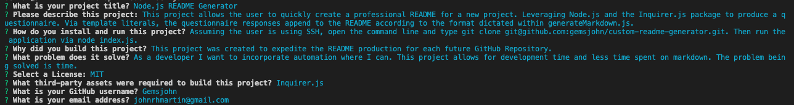

  # <b>Node.js README Generator</b>
  

  # <b>Table of Contents</b>
  - [Description](#description)
  - [Installation](#installation)
  - [Usage](#usage)
  - [License](#license)
  - [Contributing](#contributing)
  - [Questions](#questions)
  - [Screenshot](#screenshot)

  # Description
  
This project allows the user to quickly create a professional README for a new project. Leveraging Node.js and the Inquirer.js package to produce a questionnaire. Via template literals, the questionnaire responses append to the README according to the format dictated within generateMarkdown.js.

  # Installation
  
Assuming the user is using SSH, open the command line and type git clone git@github.com:gemsjohn/custom-readme-generator.git. Then run the application via node index.js.

  # Usage
  
This project was created to expedite the README production for each future GitHub Repository. 

  
As a developer I want to incorporate automation where I can. This project allows for development time and less time spent on markdown. The problem being solved is time.

  # License
  
<a href="https://opensource.org/licenses/MIT">MIT License, Copyright (c) 2022 John Martin</a>

  # Contributing
  
The following third-party asset(s) contribute to the production of this Node.js Readme Generator:

  
Inquirer.js

  # Questions
  
Feel free to follow my GitHub account: <a href="https://github.com/Gemsjohn">Gemsjohn</a>

  
If you have any questions about this project feel free to reach me at the following email address: johnrhmartin@gmail.com

  # Screenshot
  

